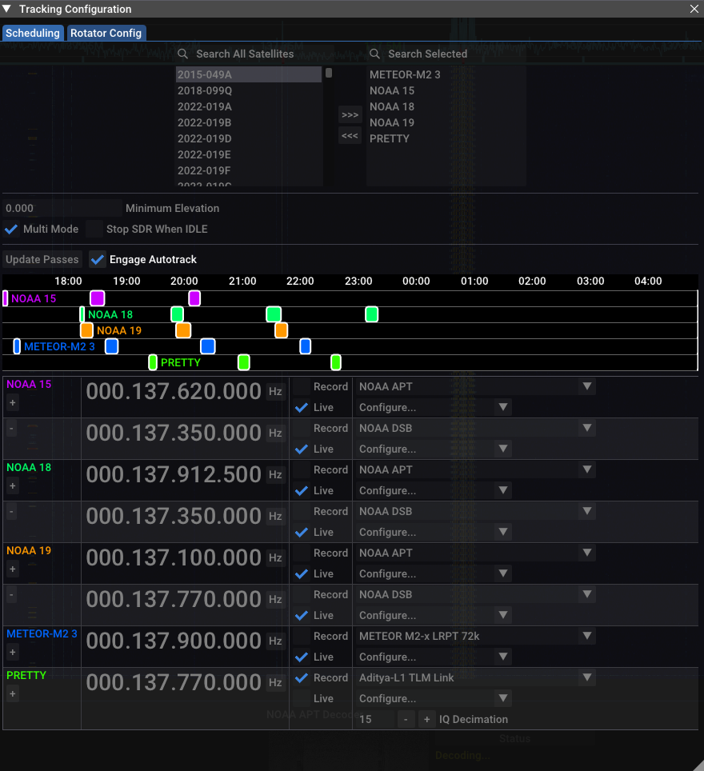
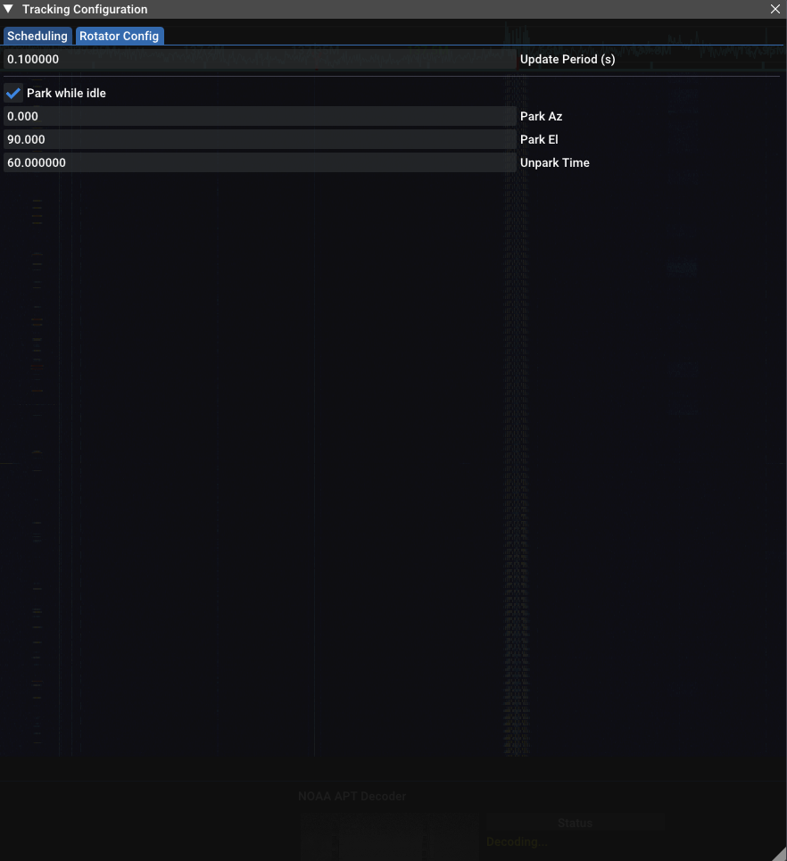

Autotrack - Or automated satellite tracking
===========================================

Introduction
------------

Automated satellite tracking (usually referred to as "Autotrack", for AUTOmated-TRACKing) in SatDump is meant to provide a solution to design (more or less) fully automated satellite reception stations.
Such a system will usually consist of an antenna (either omnidirectional or directional), optionally a rotator, and a computer running SatDump with some SDR hardware. 
The design and assembly of such a system will not be described here as it is not within the scope of this documention. 

SatDump will handle the *scheduling*, *tracking*, *live-processing/recording* and final *post-processing* of the data via different main components :  

* The Scheduler
* The Satellite Tracker
* The Recorder / other signal processing

All of these features are available both in the GUI and CLI versions of SatDump.

*Disclaimer : This is NOT a tutorial, rather a description of the capabilities and configuration options. If you wish to see a more specific tutorial there are better resources available.*

The Scheduler
-------------

The scheduler is the core part of the autotrack system, its role is to predict upcoming satellite passes for the station, 
filter them to generate a realistic list of what the hardware can actually do and triggering other events to actually start 
recording/processing each pass.  

Operating Modes
^^^^^^^^^^^^^^^

As outlined in the introduction, 2 type of antennas exist : omnidirectional and directional. In the case of a directional installation the antenna has to be steered toward the
satellite during the pass. Meanwhile, an omnidirectional setup is technically capable of receiving any satellite currently above the horizon at the same time given they do not 
interfere with each other and the SDR hardware used has enough bandwidth to cover both frequencies at the same time. While it is possible to keep such a system operating in the 
more widespread "single-satellite" mode, for many common systems (such as a 137Mhz station) not being affected by passes overlapping is desirable. This is why such a capability 
is present in SatDump.

By default, SatDump will operate in single-satellite mode. In this case predicted satellite passes will be filtered as to eliminate or minimize overlap as the station can - obviously - only
follow a single one at a time. For each, the frequency of the SDR will be set accordingly to the downlink frequency set in the scheduler's configuration, or if you set more than one the average 
of all frequencies will be set instead in an attempt to cover them all (this is meant to be used in case of satellites with several downlinks closeby in frequency) - if your SDR allows. 
Additionally the satellite tracker, which will both display the ongoing pass if in UI mode and control a rotator if setup will also be set upon AOS / LOS.

If **Multi Mode** is enabled, no pass filtering will be done at all. Instead, all passes will always be selected as it is left assumed the system is always capable of handling any visible 
satellite. It is also left up to the user to setup the SDR properly as the frequency or banwidth will never be changed. Therefore, the satellites and frequency configuration has
to be set by the user to match what the hardware is capable of handling within the SDR's bandwidth and center frequency.    

*Note : It is planned to automate this process further later as to not make these assumptions and cover more usecases*

CLI Configuration
-----------------

.. literalinclude:: autotrack_cfg.json
  :language: JSON

GUI Configuration
-----------------

Most of the GUI configuration is covered in the *Satellite Tracker* section of this documentation. Please refer to it for rotator configuration, setting your QTH and similar.  

Otherwise, everything will be done the following 2 menus :

|image0| 

* **Satellite Selector :** This is the menu in the top part of the window. By selecting a satellite in either and clicking the buttons in the center you can select the satellites you wish to track. The right panels is those currently selected.
* **Minimum Elevation :** This filters passes to be above a specific minimum elevation at TCA
* **Multi Mode :** Puts the scheduler in multi-satellite mode, for omnidirectional installations
* **Stop SDR When IDLE :** Stops the SDR when no satellites are being tracked
* **Timetable :** The "timetable" graph shows upcoming passes for each satellites, and highlights those selected in white when Autotrack is engaged
* **Update Passes :** Refreshes upcoming passes now. This is done automatically if engaged
* **Engage Autotrack :** Enables/Disables autotrack. Configuration is locked out when enabled
* **Satellite List :** Lets the user configure the satellites being tracked. The frequency can be set in the 2nd column, baseband recording/live-processing can be set in the 3rd column and furhter configuration in the last. The "+" and "-" buttons in the left column let you add/delete downlinks if more than one frequency is needed per satellite

|image1| 

