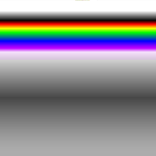

Composite System
================

Basics
------

Selecting a single channel
~~~~~~~~~~~~~~~~~~~~~~~~~~

``chX`` where ``X`` is the number of the channel

Selecting a single calibrated channel
~~~~~~~~~~~~~~~~~~~~~~~~~~~~~~~~~~~~~

   Only for these satellites and instruments \* AMSU: all satellites
   carrying it \* MHS: all satellites carrying it \* ATMS: all
   satellites carrying it \* AVHRR: NOAA 18, NOAA 19, METOP B, METOP C

``cchX`` where ``X`` is the number of the channel.

The output value will be in the range of 0 to 1. The value of 0 and 1
depends on two things:

-  The default (or specified in the ``satdump_cfg.json``) calibration
   type, such as albedo, radiance or temperature
-  The default (or specified in the ``satdump_cfg.json``) range, for
   example for AVHRR channel 4 temperature, 0 equals to 232.2 K, 1
   equals to 304.9 K.

For more information on calibration, see the Advanced section below.

Simple RGB composite
~~~~~~~~~~~~~~~~~~~~

``chR, chG, chB`` (normal)

``cchR, cchG, cchB`` (calibrated)

Math
~~~~

Any math operator is supported, such as
``+, -, /, *, cos(), sin(), ln(), ^`` and more.

Example: ``ch1^2.5, ch2, ch3`` (raises ch1 by a power of 2,5).

The acceptable value range for the output of each channel is 0 to 1 (see
above for notes regarding calibration).

Inverting a channel is simple, just subtract 1: ``1-ch4`` will invert
channel 4.

Ternary operators
~~~~~~~~~~~~~~~~~

You can use a ternary operator to select a result based on a condition.

Syntax: ``input condition ? true : false``

Example: ``cch1 < 0.5 ? 1 : 0``

Explanation: If ``cch1`` is less than 0.5, output 1 (white). If not,
output 0.

Ternary operators support these conditions: ``<, >, >=, <=, ==`` (less
than, greater than, greater or equal than, equal to)

Ternary operators can be nested, but the algorithm will quickly become
quite cumbersome to read. I recommend to use Lua for more complex
algorithms.

Alpha Channel (RGBA)
~~~~~~~~~~~~~~~~~~~~

By adding a fourth parameter to a RGB equation, it is possible to
specify an alpha channel (this is useful in combination with the ternary
operator).

Syntax: ``chR, chG, chB, chA``.

It can be used for monochrome composites that are meant to be used
together with the LUT option. In that case, the G and B parameters are
set to 0.

Example: ``cch1, cch2, cch3, cch4 > 0.5 ? 1 : 0``

Explanation: Output a RGB image composed by cch1 (red), cch2 (green),
cch3 (blue). If cch4 is greater than 0.5, the alpha channel is 1
(totally opaque). If not, it’s 0 (totally transparent).

The typical use case would be blending of sounder and imager data, for
example to show a rainfall map from MHS on AVHRR.

Advanced
--------

The advanced part covers syntax in the ``satdump_cfg.json``
configuration file, found in SatDump’s configuration directory. Also,
these settings can be added in the user-specific configuration file
called ``settings.json``.

The user-specific ``settings.json`` has priority over
``satdump_cfg.json``, therefore editing ``settings.json`` can override
the default composites, without needing to edit the configuration file.

Beware that sometimes the default composites get updated, such as when
SatDump is updated, therefore if you override them unexpected behavior
can occur. If this happens, please rename the ``settings.json`` and test
again, to isolate the issue.

The files can be found:

-  Linux:

   -  General config file: ``/usr/share/satdump/satdump_cfg.json``
   -  User config file: ``~/.config/satdump/settings.json``

-  Windows:

   -  General config file:
      ``C:\Program Files\SatDump\share\satdump\satdump_cfg.json``
   -  User config file: ``%appdata%\satdump\settings.json``

-  MacOS:

   -  The general config file **cannot** be edited due to Apple
      restrictions.
   -  User config file: ``~/.config/satdump/settings.json``

The basic syntax is as follows:

.. code-block:: json

   "Composite Name": {
      "equation": "cch1, cch2, cch3"
   }

Additional parameters can be added (mind the commas!):

.. code-block:: json

   "Composite Name": {
     "equation": "cch1, cch2, cch3",
     "individual_equalize": true
   }

Common parameters:
~~~~~~~~~~~~~~~~~~

All these parameters are boolean and accept either a ``true`` or a
``false``.

If omitted, they will be treated as ``false`` (for example, if you don’t
specify ``"equalize": true``, the image will not be equalized).
Forcefully setting these parameters to ``false`` is redundant.

-  ``individual_equalize``: histogram equalize each individual red,
   green, and blue component before combining them into an RGB output.
-  ``equalize``: combine red, green and blue components, then histogram
   equalize the result.
-  ``white_balance``: apply white balance to the result (useful for
   Meteor LRPT where black lines can sometimes mess up the
   equalization).
-  ``despeckle``: apply despeckling through the use of a Kuwahara filter (usually not needed).
-  ``normalize``: apply a normalising algorithm to the image.
-  ``apply_lut``: apply a LUT to the resulting RGB image. If only the
   red channel is specified, and all others are at zero, it will apply
   the LUT to the single channel as if it were a grayscale image.
-  ``geo_correct``: correct the output image to eliminate distortion
   caused by the Earth’s curve.
-  ``autogen``: if set to ``false``, it will prevent the autogeneration
   of this composite when SatDump processes the pipeline (so, the
   composite will only be available from the viewer).

Calibration parameters
~~~~~~~~~~~~~~~~~~~~~~

By adding a ``calib_cfg`` block as follows, it is possible to select
many parameters regarding calibration.

.. code-block:: json

   "Composite Name": {
     "equation": "cch1, cch2, cch3",
     "calib_cfg": {
         "cch1": {
            "type": "albedo",
            "min": 0,
            "max": 40
         },
         "cch2": {
            "type": "radiance",
            "min": 0.5,
            "max": 2.2
         },
         "cch3": {
            "type": "temperature",
            "min": 220,
            "max": 460
         },
      }
   }

Specific configurations can be applied for each channel independently.
If a calibrated channel is used, but a specific configuration is not
set, the default will be used.

-  ``type``: selects the calibration type. Accepted values are
   ``radiance``, ``albedo`` or ``temperature``.
-  ``min`` and ``max``: select the range that is remapped from 0 to 1 in
   the viewer.

The units are Kelvin for temperature, W·sr−1·m−2 for radiance, and
percentage (%) of albedo. (All standard SI units)

.. note::
   If you want to work with Kelvin directly in the equation,
   set ``min`` to 0 and ``max`` to 1000. Then, 273K will be 0.273 in the equation.

Projections
-----------

It is possible to customise and automate projections for each composite.
**Do not enable this parameter by default if you want to do a pull
request**, as it will result in many unnecessary files and takes quite a
lot to process. Only add it in your ``settings.json`` for your own
convenience :)

For example, this is the simplest projection that will automatically create
a GeoTIFF image (for later use in other software) of the proper size and projected
 using the equirectangular projection:

.. code-block:: json

   "Composite Name": {
      "equation": "ch2, ch2, ch1",
      "project": {
         "draw_map_overlay": true,
         "individual_equalize": true,
         "img_format": ".tif",
         "config": {
            "type": "equirec",
            "auto": true,
            "scalar_x": 0.016,
            "scalar_y": -0.016
         }
      }
   }

For further information please read the projections page.

Custom LUTs
-----------

A custom square PNG LUT can be specified. It has to be put in the
``resources/lut`` folder of SatDump.

.. code-block:: json

   "Composite Name": {
      "lut": "lut/LUT_FileName.png"
      "channels": "cch1, cch2",
   }

All of the common parameters such as ``individual_equalize`` can be
used, although they won’t affect the LUT (apart from ``geo_correct``).

-  ``lut``: the LUT file name and path relative to ``resources/``
-  ``channels``: specified the 2 channels for the two dimensional LUT.

LUTs can be either grayscale or color and are usually 256x256 pixels in
size.

|BD monochrome|

|Color NO|

Examples
--------

Overriding the default configuration
~~~~~~~~~~~~~~~~~~~~~~~~~~~~~~~~~~~~

Thanks to the user-specific ``settings.json`` it is possible to override the default configuration via the ``viewer`` array.

Here is an example that overrides some MSU-MR composites and adds new ones.

.. code-block:: json

   //to be put after the satdump_general array
   "viewer": {
      "instruments": {
         "msu_mr": {
            "221": {
               //Since 221 is already present in the main satdump_cfg.json, no need to specify the equation again, just what you want to override
               "autogen": true,
               "equalize": true,
               "white_balance": true
            },
            "421": {
               //421 is a new composite, so it has to be specified entirely.
               "equation": "ch4, ch2, ch1",
               "autogen": true,
               "geo_correct": true,
               "equalize": true
            }
         }
      }
   }

.. note::
   If you just want to enable autogeneration of some products that have ``"autogen": false`` set in their options, just add this and put it in the section for the instrument name as shown above:

   .. code-block:: json
      
      "composite_name": {
         "autogen": true
      }
      

