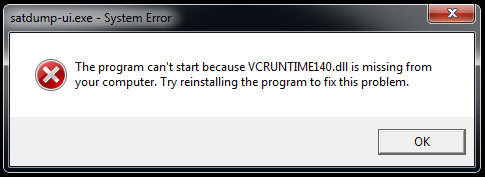
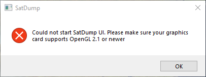
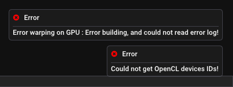
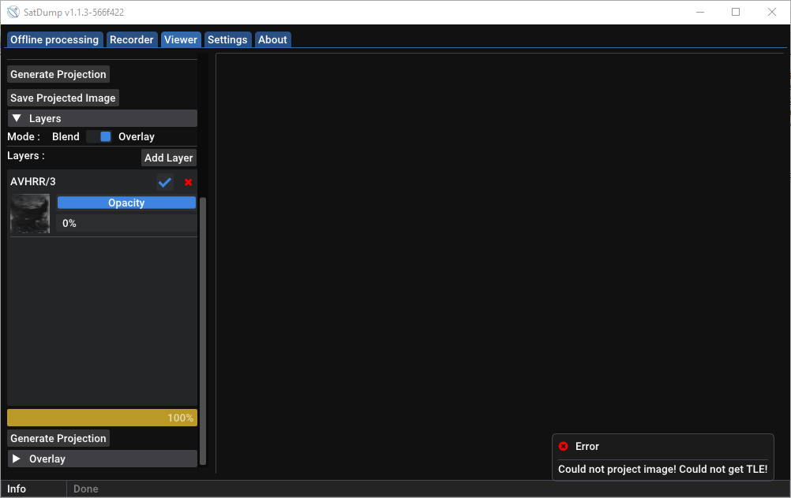
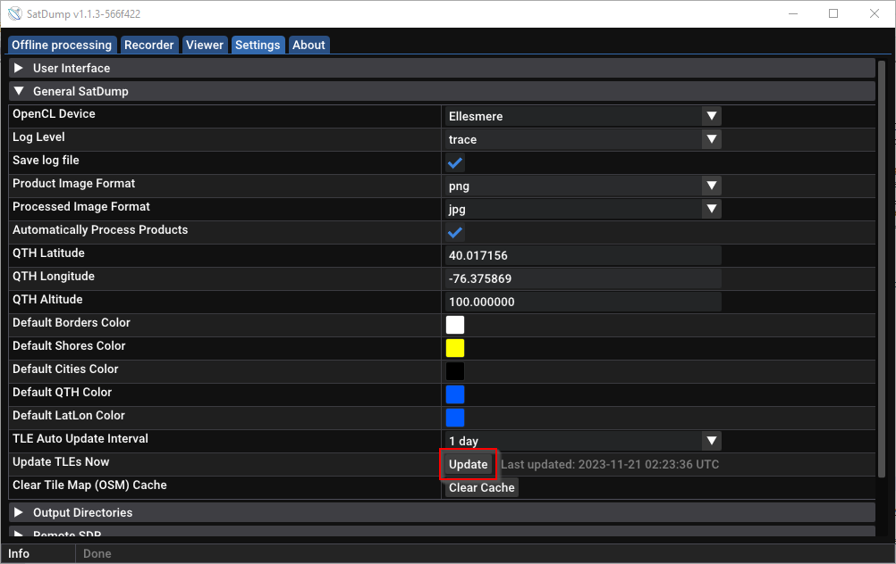
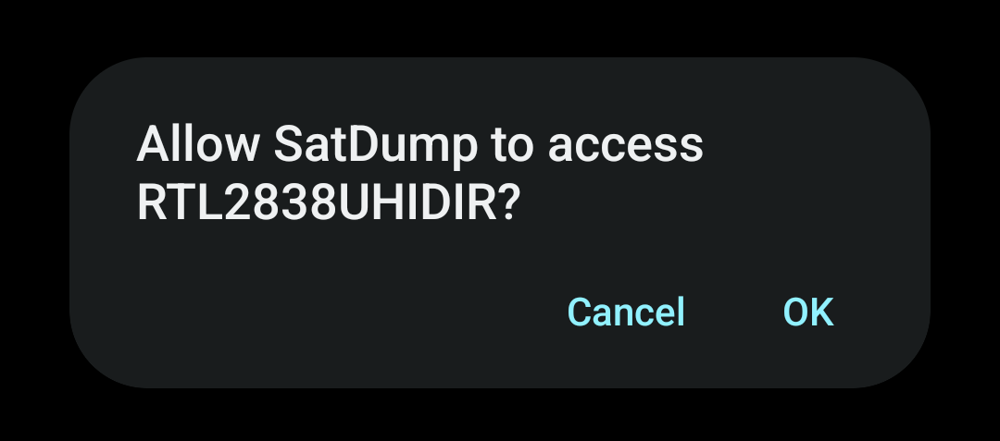
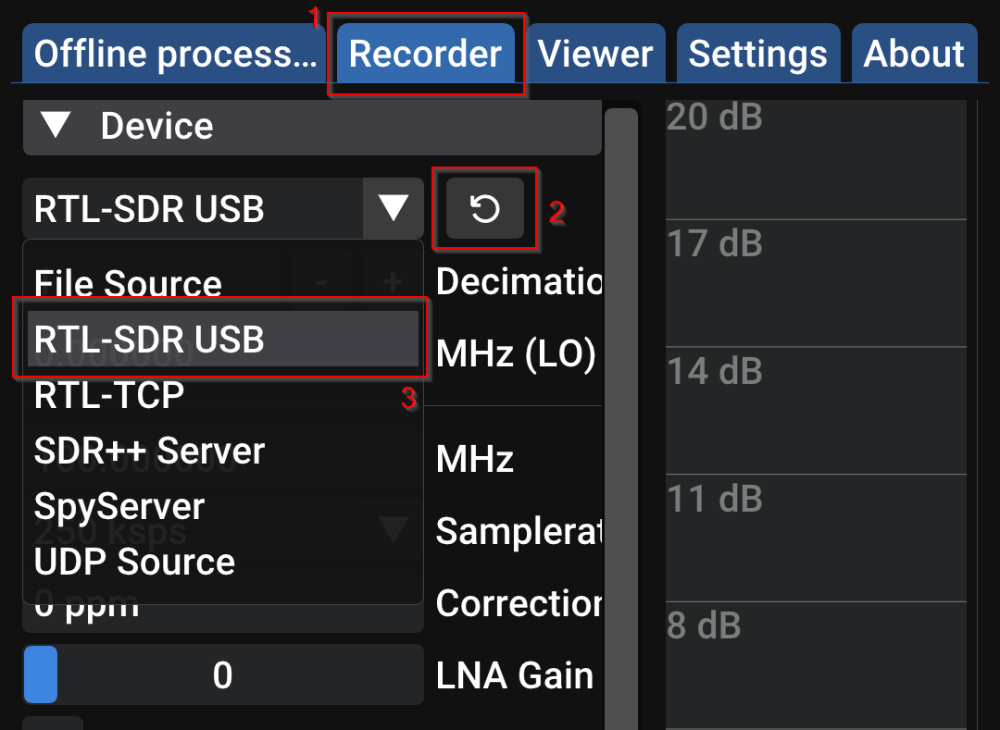

FAQ/Troubleshooting
===================

Are you running into issues getting started with SatDump? No problem! We've compiled a list of common problems and trobleshooting steps to 
get you going in no time. As a general rule of thumb, make sure you try the latest nightly build `from the downloads page <https://www.satdump.org/download/#nightly>`__
before trying anything else, as we may have fixed your issue.

Missing DLLs Reported on Windows
--------------------------------

**Problem:** When Launching SatDump UI, CLI, or SDR Server on Windows, you are presented with an error about missing dll(s):

|image0|

**Solution:** You have not installed the Microsoft Visual C++ Redistributable for 2015-2022. Please download and install the latest version from
`https://aka.ms/vs/17/release/vc_redist.x64.exe <https://aka.ms/vs/17/release/vc_redist.x64.exe>`__.

Issues Launching SatDump UI
---------------------------

**Problem:** When launching SatDump UI on any OS, a GLFW error appears in the console, the following error message pops up and the program exits, or you
are presented with a black screen.

|image1|

**Solutions:** This happens when your graphics card does not properly support OpenGL 2.1 or higher. Don't worry - there are a number of workarounds you can try,
depeding on your Operating System.

Windows
^^^^^^^

On Windows, your first line of defense it to make sure your graphics drivers are up-to-date. The "Microsoft Basic Display Adapter" does not support OpenGL, and you should
install the correct graphics drivers for your system.

If installing proper drivers is not possible, or if you have an old card where the newest drivers do not support OpenGL 2.1, there is a workaround. Download the 64-bit
opengl32.dll from `https://fdossena.com/?p=mesa/index.frag <https://fdossena.com/?p=mesa/index.frag>`__. Extract the download, and copy the DLL into your SatDump program folder.
Afterwards, SatDump should open normally.

.. note::
   The custom DLL uses software rendering to display SatDump. This will result in a low framerate, but the software should be useable.

Linux
^^^^^

On Linux, you also want to make sure your graphics driver is up-to-date. Most Linux distros ship with OpenGL drivers for the majority of common graphics cards, so this is
typically not a concern. Instead, try the following commands from a terminal to see if you can get SatDump to launch

* ``MESA_GL_VERSION_OVERRIDE=4.5 satdump-ui``: Forces SatDump to try using OpenGL 4.5
* ``MESA_GL_VERSION_OVERRIDE=2.1 satdump-ui``: Forces SatDump to try using OpenGL 2.1
* ``LIBGL_ALWAYS_SOFTWARE=1 satdump-ui``: Forces SatDump to use software-only rendering

**Building for OpenGL ES 2.0:** Some systems, especially embedded systems or SBCs like the BananaPi and OrangePi, do not support OpenGL. Instead, they support OpenGL ES 2.0.
SatDump supports OpenGL ES 2.0, but you must build it specifically for these systems. Add ``-DBUILD_GLES=ON`` to your SatDump cmake command to enable support.

.. note::
   All modern distros for the Raspberry Pi Support Desktop OpenGL 2.1 or higher, so building for GL ES on these systems is not required.

macOS
^^^^^

macOS ensures that OpenGL works out-of-the-box on all supported hardware/OS combinations. If you are experiencing OpenGL issues, you most likely have a misconfigured Hackintosh,
you have modified your Mac's bootloader to run newer versions of macOS than is officially supported, or you are running macOS in a Virtual Machine. These configurations are not
supported, and there are no workarounds available.

OpenCL Issues
-------------

**Problem:** When processing products or generating projections, errors as shown below appear and processing takes a long time.

|image2|

**Solutions:** SatDump uses OpenCL to accelerate many computations, including those used in making overlays/projections. This error happens when SatDump cannot access OpenCL for
some reason. SatDump will still work as expected, but at a fraction of the speed. Resolving the error depends on your Operating System, CPU, and Graphics Card.

* **Windows - Intel/AMD/NVidia Graphics:** OpenCL is included with the latest graphics drivers for your card. Try updating your graphics drivers to resolve OpenCL issues.
* **Windows - Intel CPU:** If GPU-based OpenCL is not working for you, you can try installing the CPU-based OpenCL runtime for Intel processors from
  `Intel's website <https://www.intel.com/content/www/us/en/developer/articles/technical/intel-cpu-runtime-for-opencl-applications-with-sycl-support.html>`__.
* **Linux - Intel Integrated Graphics:** Install the ``intel-opencl-icd`` (or equivalent) package from your distro's package manager.
* **Linux - AMD Graphics:** Follow the instructions `at this site <https://math.dartmouth.edu/~sarunas/amdgpu-opencl.html>`__ to install OpenCL drivers. It is *not recommended* that
  you install the full AMD Pro drivers.
* **Linux - NVidia Graphics:** Install the proprietary NVidia drivers on your system and reboot. You may need to add your user to the ``video`` group and reboot before OpenCL works.
* **Linux - Intel CPU:** Install the ``intel-oneapi-runtime-opencl`` (or equivalent) package to enable OpenGL on CPU.
* **macOS:** OpenCL should be supported on all Macs as of this writing. If you esperience any issues, try building SatDump from source or
  `create an issue on GitHub <https://github.com/SatDump/SatDump/issues>`__.
* **Android and SBCs like the Raspberry Pi:** OpenCL is not supported on these devices at this time.

Projection or map overlays are missing/incorrect
------------------------------------------------

**Problem:** When attempting to use the map overlay or projection features in SatDump, their either don't work at all, or the map/image is in the wrong place.

|image3|

**Solutions:** Projections/overlays can be incorrect for a number of reasons:

* **Your TLEs are out-of-date/missing:** got to SatDump Settings > General SatDump > Update TLEs now to update your TLEs, then re-decode the data.
  |image4|

* **You did not set the start time of the pass:** NOAA APT requires a valid start timestamp in order to project imagery. Meteor HRPT also requires a rough estimate of the
  pass start time, if you're decoding it more than a day after the pass. Verify that you have specified the timestamp and try again
* **The Satellite's on-board clock is wrong:** sometimes satellites lose track of time - but don't we all? The Meteor satellites are notorious for this behavior. Unfortunately,
  there's not much you can do if this happens.

SDR Issues
----------

SDR issues can be specific to your platform and SDR, but there are general troubleshooting steps you can try.

On Windows, SatDump cannot see my SDR
^^^^^^^^^^^^^^^^^^^^^^^^^^^^^^^^^^^^^
The inability to see/start SDRs in Windows usually comes down to improper driver installation. Follow the typical driver installation instructions for your SDR to get started.

Here's a list of drivers for popular SDRs:

* **RTL-SDR (including NooElec, etc), AirSpy, AirSpy HF, and HackRF:** WinUSB, installed automatically or via `Zadig <https://zadig.akeo.ie/>`__
* **Miri SDRs (often sold as RSP1 "clones"):** libusb-win32, installed via `Zadig <https://zadig.akeo.ie/>`__. You may need to uninstall/reinstall the driver a few times
  for it to work correctly. Make sure the SDRPlay API is not installed or running when using this driver!
* **SDRPlay SDRs (RSP1a, RSPDuo, RSPdx):** Use the official SDRPlay API from the `SDRPlay website <https://www.sdrplay.com/api/>`__.

On Linux, SatDump cannot see or open my SDR
^^^^^^^^^^^^^^^^^^^^^^^^^^^^^^^^^^^^^^^^^^^

On Linux, the correct libraries to access your SDR should already be installed by the build/installation process. However, for some SDRs, you may need to blacklist kernel
modules or set up udev rules.

* **RTL-SDR:** Ensure the RTL-SDR udev rules are set up under ``/lib/udev/rules.d/``. On some systems, you may need to add your user to the `plugdev` group
* **MiriSDR:** You may need to blacklist some kernel modules. Edit ``/etc/modprobe.d`` and add the following lines:

.. code-block::

   blacklist msi001
   blacklist msi2500

I cannot access my SDR on SatDump for Android
^^^^^^^^^^^^^^^^^^^^^^^^^^^^^^^^^^^^^^^^^^^^^

Android has support for a limited number of SDRs over USB. Supported devices include RTL-SDR, Airspy, AirspyHF, LimeSDR Mini, and HackRF. The first time you use a USB-based
SDR with your Android phone, it will prompt you to allow access to the SDR. Tap OK.

|image5|

Then, go to the Recorder screen, and tap "refresh" for your SDR to show up.

|image6|

Where are SatDump logs?
-----------------------

SatDump's logs are named satdump-\<timestamp\>.log. Logs older than 3 days old are automatically deleted. They can be found at diffent locations, depending on your install
type and Operating system.

* **Windows (Installed):** ``%AppData%\satdump``
* **Windows (Portable):** ``\<SatDump program folder\>\config``
* **Linux and macOS** ``~/.config/satdump``

Other Problems
--------------

Have you encountered a problem not mentioned here? Take a look at our other docs, and if nothing seems to work,
`create an issue on GitHub <https://github.com/SatDump/SatDump/issues>`__ or `reach out to us on Matrix <https://matrix.to/#/#satdump:altillimity.com>`__.

