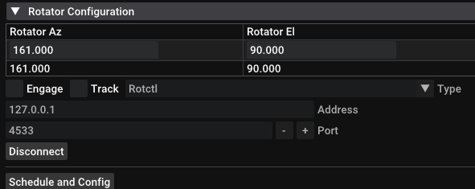
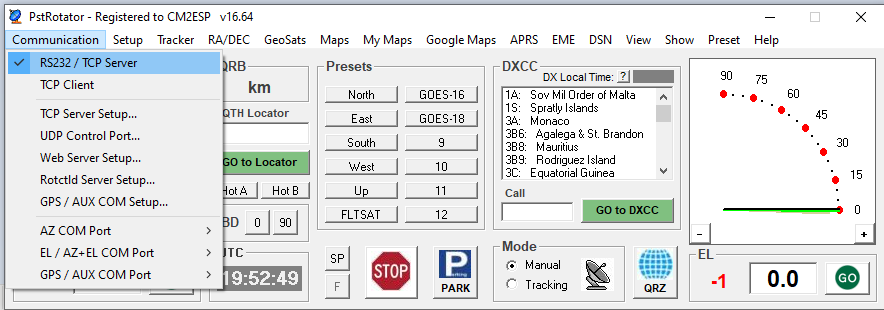

Satellite Tracker
=================

The tracking widget can be used to automate reception of satellites.

There three supported configurations with the tracker:

#. **Manual (stand-alone)**: manually select a satellite and view information about it.
#. **Semi-automatic**: manually select a satellite and start the tracking, then automatically control an antenna rotator during that specific satellite pass.
#. **Full automatic (scheduler)**: automatically select a satellite according a schedule, start a SDR automatically, select a pipeline, control a rotator and process the pass automatically.

Tracker Interface
-----------------

|image0|

Polar Plot
~~~~~~~~~~

|image1|

The polar plot is a chart of azimuth and elevation. The top of the plot
is 0° azimuth, the right is 90° azimuth, bottom is 180°, and
left is 270°. The center of the plot represents 90° elevation, while the first ring
from the center is 60°, the second is 30°, and the outer ring is 0° (horizon).

* **Orange line**: represents the path of the satellite
* **Red dot:**: represents the position of the satellite
* **Blue cross**: represents the target attitude of the rotator
* **Blue circle**: represents the actual attitude of the rotator

In the top left corner, some information about the spacecraft is shown:

* Name of the spacecraft
* Current location information
* Acquisition of signal / loss of signal times

Satellite Selector
~~~~~~~~~~~~~~~~~~

|image2|

The satellite selector allows you to choose which object you are
tracking. It has 2 modes, ``Satellites`` and ``Horizons``.

Satellites
^^^^^^^^^^

The ``Satellites`` mode will read from a list of TLEs (downloaded by SatDump).

Horizons
^^^^^^^^

The ``Horizons`` selects out of Earth orbit spacecrafts from NASA's Horizons system.

.. note::

   The ``Horizons`` mode will take a few moments to load, as it requests data from JPL's servers. For this reason, it will **not** work without an Internet connection.

Object Information
~~~~~~~~~~~~~~~~~~

|image3|

Displays information about the object you are tracking:

* Azimuth
* Elevation
* Next AOS / LOS events
* Rate of change of azimuth or elevation

Interfacing SatDump with an antenna rotator
-------------------------------------------

SatDump features support for satellite tracking using a generic antenna rotator
interfacing through third party rotator controller daemons such as Hamlib’s
rotctld and YO3DMU’s PstRotator. 

While Hamlib rotctld and PstRotator handle the hardware communications requirements and the
specific rotator protocols and configuration, SatDump communicates with these apps at
software level using a common protocol.

This allows SatDump to agnostically control and command every type of rotator supported by
these two daemons without having to deal with complex or specific rotator settings.

Such option allows to have either the rotator controller connected directly to the same PC where SatDump is
running, but also to connect via network to a remote different computer that handles the rotator, for example in a shack.

|image4|

Rotator UI
~~~~~~~~~~

* ``Rotator Az`` and ``Rotator El`` control and display the rotator position.

   * The first row is an editable text box that shows the latest commanded position.
      * These will be automatically updated when a satellite is being tracked.
      * If the selected satellite is below horizon or not being tracked, you can manually enter the desired position (for example, to test the rotation).
   *  The second row shows the actual position reported by the rotator, where is
      it pointing currently.
      In order to work, the rotator daemon must be running and connected to SatDump.
*  ``Engage``: enables the sending of position commands to the rotator.
   Whenever a new position is written and ``Engage`` is enabled, the rotator
   will be commanded to go there.
*  ``Track``: enables tracking. When enabled, the
   position entry text box will be automatically updated with the
   satellite position while it is above the horizon or the expected AOS
   position if it’s not in sight yet.
*  **Protocol Selection**: selects the protocol or type of
   controller daemon you want to use. Currently, only rotctl and
   PstRotator are supported.

   .. note::

      PstRotator is untested.
      Rotctl is preferred and highly recommended.

*  **Controller Daemon TCP/IP Settings**: allows configuration of
   the network communication settings with the controller daemon.
   *  ``Address``: IP address of the computer where is the controller daemon
   server running. 
      
      .. note::

         Enter ``127.0.0.1`` if Rotctld or PstRotator are
         running on the same computer as SatDump is, or the remote computer IP
         if the daemon is running on a different computer.

   *  ``Port``: Defines the TCP port where is listening the daemon server. ``4533``
   is Rotctld’s default port, while ``4002`` is the default for PstRotator.

   *  ``Connect/Disconnect``. This button connects and disconnects from the
   daemon server controller.
*  ``Schedule and Config`` opens a window containing the ``Scheduling`` tab and a ``Rotator Config`` tab.
   |image5|
   The Rotator Config tab contains the ``Update Period`` text box. This is the refresh rate for the rotator controller expressed in
   seconds. This value defines the polling and rotating intervals.

Configuration with Hamlib's rotctld
~~~~~~~~~~~~~~~~~~~~~~~~~~~~~~~~~~~

This guide only cover the basic instructions for Rotctld. Please refer
to `Hamlib’s documentation and
guide <https://hamlib.sourceforge.net/html/rotctld.1.html>`__ for details on how to download and install it, as well to
setup your rotator.

-  Launch the rotctld app with the settings required for your specific
   hardware rotator controller.
-  Go to SatDump and select ``rotctld`` in the configuration panel.
-  Type the IP Address and TCP port as required (4533 the default port).
-  Click ``Connect``.
-  Click ``Engage`` to start sending commands to the rotator.

|image6|

Configuration with PstRotator
~~~~~~~~~~~~~~~~~~~~~~~~~~~~~

.. note::

   PstRotator is untested.
   Rotctl is preferred and highly recommended.

This guide only cover the basic instructions for PstRotator. Please
refer to `YO3DMU’s PstRotator
Website <https://www.pstrotator.com/>`__ for details on how to download and install it, as well to
setup your rotator. Most of the configuration steps in PstRotator only
needs to be done one time as it will save the settings when
closed.

Using PstRotator protocol
^^^^^^^^^^^^^^^^^^^^^^^^^

.. note::

   This method is **not** recommended. PstRotator's rotctld protocol emulation should be used instead.

-  Launch PstRotator and configure the settings for your specific
   hardware rotator controller.
-  On the Communication Menu, select and enable RS232 / TCP Server. This
   setting should be enabled by default.

|image7|

-  In the ``Mode`` box in PstRotator select ``Manual``. While PstRotator
   includes internal modules for both satellite and astronomical objects
   tracking, it’s highly recommended not using them while using it with
   Satdump to avoid conflicts.
-  It’s also recommended to enable the options ``Start in Manual Mode``
   and ``Localized KBD Shortcuts`` in the PstRotator Setup Menu to avoid
   conflicts and tracking issues.
-  Go to SatDump and select ``PstRotator`` in the configuration panel.
-  Type the IP Address and TCP port as required (4002 is the default port)
-  Click ``Connect``
-  Click ``Engage`` to start sending commands to the rotator.

Using PstRotator Hamlib Rotctld protocol emulation
^^^^^^^^^^^^^^^^^^^^^^^^^^^^^^^^^^^^^^^^^^^^^^^^^^

-  Launch PstRotator and configure the settings for your specific
   hardware rotator controller.
-  Navigate into Setup Menu and click to enable ``Rotctld Hamlib Server``.
   Be sure you don’t have an actual Rotctld instance running as both
   apps will try to use the same TCP port. |image8|
-  On the Communication Menu, click at ``Rotctld Server Setup`` and check
   that default port 4533 is selected. Also uncheck and verify that
   ``Extended protocol`` is not selected. Click ``Save Settings`` and press Escape to
   close the config dialog.

|image9|

-  Go to SatDump and select ``rotctl`` in the configuration panel.
   panel

   .. warning::
      Do not select ``PstRotator``.

-  Type the IP Address and TCP port as required (4533 is the default port)
-  Click in Connect.
-  Click ``Connect``
-  Click ``Engage`` to start sending commands to the rotator.

